# 06 · Five context failure modes

> **TL;DR.** When an LLM application starts producing bad answers, the bug is almost never "the model got worse". It is one of five well-defined **context failure modes**: distraction, confusion, conflict, lost-in-the-middle, and tool-storm. Each has a recognisable symptom, a mechanical cause traceable to the six layers, and a first-fix that is cheap to apply. This post catalogues all five so the rest of the series has a vocabulary for talking about what *went wrong*, not just what to do *right*.
>
> **After reading this you will be able to:**
> - Name the five failure modes and the symptom each produces.
> - Diagnose any production-bug report by mapping it to one (or two) of them.
> - Apply the first-fix for each mode without needing a model upgrade or a framework switch.

*The five context failure modes, each mapped to the context layer where it originates and the WSCI operation that fixes it.*

---

## 1. Why a taxonomy

In the early months of any LLM project, every bug feels unique. Users complain that "the bot is dumber today", or "the agent keeps repeating itself", or "it ignored the policy I told it about an hour ago". Engineers respond by tweaking the system prompt, adding a few-shot example, or escalating to a stronger model. Sometimes it works; usually it works for a week and then stops.

The reason the fixes do not stick is that the team is treating each report as a story rather than as a class. Practice across many production deployments, converging in Breunig's *"How Long Contexts Fail"* (2025) and Anthropic's *"Effective context engineering"* (2025), has settled on a short list. Five recurring failure modes account for almost everything that goes wrong with the *context* of a modern LLM call. The model itself is rarely the actor.

This series **adapts** Breunig's taxonomy (Poisoning, Distraction, Confusion, Clash) rather than copying it. Two of Breunig's modes are renamed for clarity (Clash becomes **Conflict**), one is moved: **poisoning** is fundamentally an adversarial problem, so it is deferred to [Post 23](../23-security/index.md) on security. In its place, this post adds two modes that the agent era made unavoidable: **lost-in-the-middle** (long-context recall failure) and **tool-storm** (runaway tool loops). The result is the five modes catalogued below.

The taxonomy uses a consistent shape for each entry: **symptom** (what users report), **mechanism** (why it happens, in terms of the six context layers introduced in [Post 02](../02-six-layers-of-context/index.md)), **first-fix** (the cheapest thing that usually works), and **last-resort** (what to reach for if the first-fix does not).

---

## 2. Distraction

**Symptom.** The model latches on to a stray phrase or chunk that sits in the context, producing an answer that is fluent and confidently off-topic. A user asks about cancellation policy; the model lectures about shipping. A coding agent asked to fix a null check rewrites a different function entirely.

**Mechanism.** Distraction is a **layer 04 (Retrieval) problem most of the time and a layer 01 (System prompt) problem the rest of the time.** Either the retrieval pipeline is selecting chunks that share surface vocabulary with the question but not its intent, or the system prompt is over-broad and gives the model permission to wander. A long conversation history (layer 05, History) can also act as a distractor, especially when older turns rehearsed a different topic.

The mechanical cause is attention dilution. When the relevant signal is one chunk in a soup of irrelevant ones, softmax spreads the attention thin, and the model effectively operates on a blurry average. The longer the soup, the worse the dilution. This is also why distraction worsens *with* context length, not *despite* it.

**First-fix.** Tighten Select. Lower retrieval `k` (the number of chunks retrieved per query, the top-k). Add a reranker (a second-stage model that re-scores the retrieved candidates and drops the weakest). Verify that the embedding model is appropriate for the domain (a code agent on a generic prose embedding is a classic distraction trap). If the system prompt is broad ("you are a helpful assistant"), narrow it ("you answer only billing questions; refuse all other topics with the line …").

**Last-resort.** Replace flat retrieval with a router that classifies the question first and selects from a topic-scoped index. Add a "is this answer on-topic?" cheap-model check before returning to the user.

---

## 3. Confusion

**Symptom.** The right information is demonstrably present in the context, and the model still makes the wrong choice. A tool is invoked with the wrong argument, a date is reformatted incorrectly, the policy is summarised correctly and then violated in the next sentence.

**Mechanism.** Confusion is the **layer 01 (System prompt) and layer 02 (Tools) failure mode**. The information was there; the *rules* about what to do with it were not. Common shapes:

- A tool description says *"call this when the user asks about orders"* without saying *"and never call it for refunds; for refunds use `issue_refund`"*.
- The system prompt lists ten rules in prose paragraphs; the model picks the easiest one to follow and ignores the others.
- Two rules contradict each other quietly (one in the system prompt, one in a memory cell).

The underlying cause is that LLMs are pattern-completers, not policy interpreters. When the policy is implicit, ambiguous, or buried, the model substitutes whatever pattern its training distribution suggests for the surface form of the request.

**First-fix.** Make the rules **explicit, motivated, and exemplified**. Replace prose paragraphs with numbered constraints. Add one negative example per rule (the kind of mistake the rule is preventing). Move the rule into the tool description if it is about a tool. Six rules for rules: *one concept per rule · motivated by a real failure · positive over negative · specific over vague · examples beat instructions · reviewed like code.*

"Motivated by a real failure" is the one most teams skip. A rule that reads *"Be careful with refunds"* is vague and un-motivated; rewritten from the failure that produced it, it becomes *"Never issue a refund above \$50 without a manager approval token; the bot once refunded \$4,000 unprompted."* The second version names the concept, the threshold, and the incident that justifies it. Each of the six rules is shown worked in [Post 14](../14-system-prompt-as-software/index.md).

**Last-resort.** Move the constraint out of the prompt and into code. A send-gate ([Post 30](../30-capstone-email-reply-agent/index.md)) or a tool-side validator enforces what the model was only being asked to respect.

---

## 4. Conflict

**Symptom.** The model wavers, contradicts itself, or produces an answer that is internally inconsistent. The first paragraph says one thing, the second paragraph the opposite. A multi-turn conversation slowly inverts a position the agent stated firmly earlier.

**Mechanism.** Conflict is the **cross-layer failure mode.** Two pieces of context disagree, and the model has no instruction about which one wins. Typical shapes:

- A semantic-memory cell says the user prefers Python; a recent retrieved chunk shows the user writing TypeScript.
- The system prompt forbids X; an episodic memory note says "user explicitly approved X last month".
- Two retrieved chunks come from different versions of the same document; both say "current as of 2024".

The model, faced with conflict, will usually pick the version that is most recent in the prompt, or the version that is more specific, or the version that is repeated more often. None of these is a deliberate decision. From the user's point of view, the agent looks unprincipled.

**First-fix.** Add a **provenance and recency stamp** to every memory cell and every retrieved chunk. Add an explicit precedence rule to the system prompt ("when sources conflict, the most recent one wins; when timestamps tie, the one with higher confidence wins"). Run a deduplication pass on the retrieved set so two near-identical chunks do not vote twice.

**Last-resort.** Resolve the conflict in the retrieval layer, before the model sees it. A small "conflict resolver" sub-agent reads the candidate set, picks the winning version with a reason, and only the winner is packed into the main context.

---

## 5. Lost in the middle

**Symptom.** Quality is fine on short prompts and fine on prompts where the answer is at the very start or very end. As soon as the relevant content lands in the deep middle of a long context, recall drops and the model behaves as if the content were not there.

**Mechanism.** This is the failure mode the long-context literature has picked at the longest. Liu et al. (2023; TACL 2024) measured it directly: across every model they tested, a relevant document placed at position 1 of *k* or position *k* was recovered well; the same document at position *k*/2 was recovered poorly, sometimes below the no-document baseline. Later benchmarks sharpened the picture. RULER (Hsieh et al., 2024) showed that a model's *effective* context is often far shorter than its advertised window, and Chroma's *"Context Rot"* report (Hong et al., 2025) found recall and reasoning degrading steadily as input length grows, even on tasks well within the stated window. The cause is the interaction of positional encoding (extrapolated past the training regime) and attention budget (spread across more tokens than the model is used to). Both were covered in [Post 03](../03-how-llms-read-context/index.md).

In practical terms, the failure mode appears whenever **retrieval (layer 04, Retrieval) or history (layer 05, History) grows past a few tens of thousands of tokens** and the system relies on the model to pick the relevant part out of the middle.

**First-fix.** **Bookend packing.** Place the highest-ranked retrieved chunk first and the second-highest last; weaker chunks fill the middle. Make sure the user's instruction is the very last thing the model sees. For history, summarise older turns into a brief at the start of the message list, then keep recent turns verbatim at the end.

**Last-resort.** Chase the cause, not the symptom. If the middle is so long that bookending no longer rescues it, the system has out-grown its retrieval `k` and needs a tighter Select stage, an aggressive Compress stage ([Post 12](../12-compress-strategies/index.md)), or an Isolate split into sub-agents ([Post 13](../13-isolate-strategies/index.md)).

---

## 6. Tool-storm

**Symptom.** An agent loops, calling the same tool over and over with slightly varied arguments, never producing a final answer. Or it calls many tools in rapid succession without using any of their results. Cost spikes, latency spikes, and the trace looks like a panicked search.

**Mechanism.** Tool-storm is the **layer 02 (Tools) failure mode.** Three sub-causes account for almost all instances:

1. **Catalogue too large.** The model is presented with so many tools that it cannot reliably discriminate the right one. It tries several, gets ambiguous results, tries more.
2. **Descriptions too vague.** The right tool is in the catalogue but its description does not include the specific situation in which to call it. The model picks the closest-sounding name and gets a wrong-shaped result.
3. **No "stop" condition.** The system prompt does not tell the model when to give up tool-calling and answer with what it has. The model treats failure as a reason to try again.

There is also a fourth, sneaky cause: a tool that returns enormous payloads. The model uses up its decode budget reading tool output and never reaches the answer.

**First-fix.** Trim the catalogue to the tools actually used in this conversation (retrieval-augmented generation, RAG, over tool schemas; see [Post 15](../15-tools-and-mcp/index.md)). Rewrite each tool description to include *when not to call it*. Add a budget rule to the system prompt ("you have at most three tool calls per turn; after three, answer with what you have"). Cap tool-result size in the wrapper, not in the prompt instruction.

**Last-resort.** Move tool selection out of the agent into a deterministic router. The model never sees the full catalogue; it sees only the two or three tools the router pre-selected for the current question.

---

## 7. A diagnostic checklist

When a bug report arrives, walk the five questions in order. The first that earns a yes is almost always the right one.

1. **Is the answer fluent but off-topic?** → Distraction. Look at the retrieved set first, the system prompt second.
2. **Is the answer consistent with the rules but the rules were violated?** → Confusion. Audit the system prompt and tool descriptions for ambiguity.
3. **Does the answer contradict itself, or contradict an earlier turn?** → Conflict. Check memory and retrieval for two sources disagreeing.
4. **Does quality drop when the context gets long, even though the relevant content is in there somewhere?** → Lost in the middle. Pack with bookends; otherwise compress.
5. **Is the trace full of tool calls without progress?** → Tool-storm. Trim the catalogue or cap the loop.

The same mode wears different clothes in different products. In a **coding agent**, Distraction looks like editing the wrong file, Tool-storm like re-running the test suite in a loop, Lost-in-the-middle like forgetting a constraint stated fifty files ago. In a **customer-support agent**, the same three read as answering a shipping question with a returns policy, repeatedly querying the orders API, and dropping a detail the customer gave ten turns back. The diagnosis is identical; only the surface report differs.

A small remainder are model bugs (the model genuinely cannot reason about this task at this size) or systems bugs (rate limits, truncated responses, malformed tool returns). Both are separately diagnosable; neither is a context bug.

**Detection signals.** Each mode also leaves a fingerprint in your traces that you can alert on before users complain. Distraction shows up as falling retrieval precision (the fraction of retrieved chunks that were actually relevant); Tool-storm as tool-calls-per-turn or tokens-per-turn spiking above their usual band; Lost-in-the-middle as accuracy that correlates negatively with prompt length. Conflict and Confusion are harder to catch automatically and usually surface through an LLM-judge on sampled transcripts. Instrumenting these signals is the subject of [Post 22](../22-observability/index.md).

**Mitigations map to WSCI.** Every first-fix above is one of the four operations from [Post 07](../07-write-select-compress-isolate/index.md), Write / Select / Compress / Isolate (WSCI, this series' shorthand for Lance Martin's framing):

| Failure mode | Primary WSCI operation | First-fix in one line |
|---|---|---|
| Distraction | **Select** | Lower `k`, add a reranker, scope the index. |
| Confusion | **Select** (of rules) | Explicit, motivated, exemplified rules; push into code. |
| Conflict | **Compress** / **Select** | Provenance + precedence stamp; dedupe the candidate set. |
| Lost-in-the-middle | **Compress** / **Isolate** | Bookend packing; summarise old history; split sub-agents. |
| Tool-storm | **Isolate** / **Select** | Trim the catalogue, add a stop budget, cap result size. |

---

## 8. The one failure mode that is not on this list

Worth a paragraph because it gets misdiagnosed often: **memory poisoning.** A memory cell, written in a previous session, contains content that biases (or actively misleads) the current session. The symptom looks like Confusion or Conflict, but the cause is upstream: an attacker, or an enthusiastic user, wrote something into long-term memory that should not have been there.

Memory poisoning is the *adversarial* relative of the accidental modes above (it mimics Conflict and Confusion but is planted on purpose), and it is the bridge from the failure-mode catalogue to the security catalogue. It belongs in [Post 23](../23-security/index.md), not here.

---

## Common pitfalls

- **Treating every bug as a prompt bug.** It is usually a *context-shape* bug. Tweaking the wording of the system prompt is the second move, not the first.
- **Reaching for a stronger model when the bug is Distraction.** A larger model on a noisier context is still being distracted, just more eloquently.
- **Adding more rules to fix Confusion.** Rules compound. Six clear rules beat thirty fuzzy ones.
- **Fixing Conflict by deleting one source.** That works once. The same conflict will recur from a different pair next month. Add provenance and a precedence rule.
- **Bookending without measuring.** Bookend packing is a strong default; verify it on a held-out eval before committing.
- **Treating Tool-storm as "the model going crazy".** It is a catalogue problem, a description problem, or a missing stop condition. Three knobs, all in your control.

---

## Further reading

- Drew Breunig, *"How Long Contexts Fail"* (2025): the essay this taxonomy is adapted from.
- Liu, N. F. *et al.*, *"Lost in the Middle: How Language Models Use Long Contexts"* (2023; TACL 2024): the U-curve paper behind lost-in-the-middle.
- Hsieh, C.-P. *et al.*, *"RULER: What's the Real Context Size of Your Long-Context Language Models?"* (NVIDIA, 2024): why effective context is shorter than the advertised window.
- Hong, K. *et al.*, *"Context Rot: How Increasing Input Tokens Impacts LLM Performance"* (Chroma, 2025): recall and reasoning degrading with input length even inside the stated window.
- OpenAI / Google, *"MRCR"* (Multi-round co-reference resolution, 2025): a harder multi-needle long-context recall benchmark.
- Anthropic Engineering, *"Effective context engineering for AI agents"* (2025): the layer-by-layer view of failure surfaces.
- Greshake, K. *et al.*, *"Not what you've signed up for: Compromising real-world LLM-integrated applications with indirect prompt injection"* (2023): the adversarial relative of these modes, covered fully in [Post 23](../23-security/index.md).
- LangGraph documentation: an alternative split with overlapping vocabulary.

Full citations in [REFERENCES.md](../../REFERENCES.md).

---

## What to read next

- **[Post 07 — Write, Select, Compress, Isolate](../07-write-select-compress-isolate/index.md)**: the four operations that fix the five failure modes.
- **[Post 20 — Evaluation](../20-evaluation/index.md)**: how to measure each of these failure modes continuously.
- **[Post 23 — Security](../23-security/index.md)**: when poisoning is *adversarial*, not accidental.
