# 13 · Isolate strategies

> **TL;DR.** *Isolate* is the WSCI operation that gives up on a single context window and uses several. The two patterns that recur in production are **sub-agents** (a parent decomposes a task and delegates pieces to children with their own clean contexts) and **sandboxing** (tool execution happens in a process whose noisy output never enters the model's context). Done well, isolation is among the strongest structural quality levers once retrieval is in place. Done badly, it multiplies the token bill while introducing coordination bugs that the single-agent design did not have.
>
> **After reading this you will be able to:**
> - Decide when a task should be isolated and when it should not.
> - Specify the input and output contracts a sub-agent needs to be safe to deploy.
> - Pick among sequential, fan-out / fan-in, and supervisor topologies.



*A parent agent delegates a scoped task to a sub-agent with its own clean context; only the structured result returns, leaving the parent's window uncluttered.*

---

## 1. Why isolation matters

Single-agent designs hit a wall around the place where four things happen at once: the conversation is long, the toolbox is large, multiple sub-tasks compete for attention, and at least one sub-task generates noisy intermediate output (logs, search results, file dumps). Beyond that wall, every WSCI (write / select / compress / isolate) lever applied to a single context (bigger compression, harder selection, tighter writing) gets diminishing returns. Isolation breaks the wall by *splitting the problem*: each piece runs in its own context, with its own tools, its own memory, its own budget. Anthropic reports meaningful quality gains from this decomposition on research-style tasks, at a corresponding rise in token cost (Anthropic, "How we built our multi-agent research system", 2025).

The structural argument is symmetric to the one for microservices over monoliths. A sub-task with a clean contract is a service; the orchestrator is a router; the failure modes are smaller, but they are different, and the cost of getting the contracts wrong is higher.

**Workflow versus agent.** Before reaching for sub-agents, it helps to name the two shapes isolation can take. Anthropic draws a useful line between a *workflow* (LLM calls wired together on predetermined paths, where the control flow is written by the engineer) and an *agent* (where the model itself decides the next step at run time) (Anthropic, "Building Effective AI Agents", 2024). A workflow is deterministic and cheaper to reason about; an agent is flexible but harder to bound. The three topologies in Section 4 span this line: sequential and fan-out / fan-in are workflows; the supervisor is an agent. The default advice follows from it: prefer the simplest composition that solves the problem, and add autonomy only when a fixed path cannot.

---

## 2. The pattern: sub-agents

A sub-agent is an LLM call (or chain of calls) launched by a parent agent with three things scoped: an **input** (a focused task description and the data it needs), a **toolkit** (only the tools relevant to this sub-task), and an **output contract** (the shape of the result the parent expects).

The parent does not see the sub-agent's intermediate work. It sees the input it sent and the output it received. The intermediate context (tool calls, retries, scratchpad notes, full document reads) lives and dies inside the sub-agent's window.

This is the property that makes isolation powerful. A research sub-agent that reads, for example, ten large documents to answer a single question contributes *one short answer* to the parent's context, not the full source material behind it. A debugging sub-agent that tries seven hypotheses contributes *the one that worked*, not the six that didn't. The parent's context stays focused on the problem it is solving; the sub-agent's context stays focused on the piece it was asked to solve.

---

## 3. When to isolate (and when not to)

The single rule worth memorising:

> **Isolate when the sub-task has a clean input contract and a clean output contract. Do not isolate otherwise.**

A "clean contract" means three things:

1. **The input is fully specified.** The sub-agent does not need to ask the parent clarifying questions. If it does, the round-trip cost defeats the saving.
2. **The output is structured and finite.** The parent knows what shape of result to expect (a JSON object, a list of titles, a single number). The sub-agent cannot return "a conversation".
3. **The work is meaningfully self-contained.** The sub-agent does not need ongoing access to the parent's evolving state.

A few examples to anchor the rule.

| Task | Isolate? | Why |
|---|---|---|
| "Find the three most relevant papers and return their titles + DOIs" | **Yes** | Input clear; output structured; self-contained |
| "Read this 200-page contract and return a summary" | **Yes** | Input clear; output structured; the source never needs to enter the parent context |
| "Run the test suite and return pass/fail + failing-test names" | **Yes** | Tool result is enormous; structured output is small |
| "Help me think through the architecture of this feature" | **No** | No clean output contract; the value is the conversation |
| "Decide whether to escalate this ticket" | **Borderline** | Yes if the rules are documented; no if the decision needs context the parent has |

When a sub-task fails this test, *do not* try to isolate it anyway with prompt engineering. The result is the worst of both worlds: a chatty sub-agent that needs context the parent has to reload, paying twice for tokens to get a worse answer than a single agent would have produced.

---

## 4. The three topologies

Three ways to wire sub-agents together account for almost every production multi-agent system.

**Sequential pipeline.** Sub-agent A produces an output that is the input to sub-agent B, whose output is the input to sub-agent C. Each sub-agent has a single job. The pattern fits clear hand-offs: parse → analyse → format. The risk is end-to-end latency (each step is serial); the strength is auditability (each stage's input and output is logged independently).

**Fan-out / fan-in (map-reduce).** A parent issues *N* identical sub-tasks in parallel; each returns a partial result; the parent (or a final reducer sub-agent) merges them. The pattern fits "do this thing for each of these items": research three competitors, summarise each chapter, run the same diff against ten files. Latency is the latency of the slowest worker. Cost scales linearly with *N*. The reduction step is where most bugs hide: the merging logic is what guarantees consistency.

**Supervisor / worker.** A persistent supervisor agent decides, turn by turn, which worker to call and how to combine results. The pattern fits open-ended problems where the decomposition itself is part of the work: agentic research, complex coding tasks, end-to-end customer-support sessions. The supervisor's prompt is the most carefully engineered piece of the system; without disciplined prompting it becomes a generalist that re-implements every worker's behaviour and the workers become decorative. Concretely: a supervisor that is supposed to delegate to a coding worker starts writing the patch itself inside its own context, so the worker is never called and its clean isolated window buys nothing.

A practical rule: **start with sequential or fan-out / fan-in.** Reach for supervisor topologies only when the decomposition genuinely cannot be planned ahead of time.

---

## 5. Designing the contract

The sub-agent's prompt is half spec and half guard-rail. A skeleton that travels well:

```
You are the {role} sub-agent.

Your task: {one paragraph, no ambiguity}.

Inputs you will receive:
- {input 1}: {type, format, example}
- {input 2}: {type, format, example}

You have access to the following tools:
- {tool 1}: {when to use}
- {tool 2}: {when to use}

You MUST return a JSON object of the form:
{ "key1": <type>, "key2": <type>, "confidence": <0..1> }

Constraints:
- Do not ask clarifying questions; if the input is insufficient, return
  { "error": "<what is missing>" }.
- Do not return prose outside the JSON object.
- If you cannot complete the task within {budget} tool calls, return
  { "error": "budget_exhausted", "partial": <best effort> }.
```

The constraints section is where most novice designs are weakest. A sub-agent that *can* return prose will return prose, sometimes. A sub-agent that *can* exceed its budget will exceed its budget, sometimes. The constraints are the contract.

A second discipline that pays for itself: **validate the sub-agent's output against the schema** before the parent uses it. A small schema check (Pydantic, Zod, JSON Schema) catches the malformed-output case at the integration boundary instead of letting it propagate.

---

## 6. The pattern: sandboxing

Sandboxing is the second species of isolation, and it is structural rather than agentic. The principle: **execute the tool somewhere whose noisy output never enters the model's context.** A note on the word: *sandboxing* here means output-scoping (deciding what a tool result contributes to the context), not the security sense of containment and privilege isolation, which Post 23 covers. The two share a name and a spirit (keep the dangerous thing away from the model) but solve different problems.

The motivating example is `npm install`. A coding agent runs `npm install` to set up a project; the command produces thousands of lines of progress logs, deprecation warnings, and peer-dependency complaints, of which the model needs to know one fact (it succeeded) or three (it failed, the failing package, the failing line). Piping the entire stdout into the model's next prompt is wasteful and distracting; piping a structured `{ ok: true, duration_ms: 8742 }` is sufficient.

The mechanism:

- The agent calls a tool that runs the command in a child process.
- The child process's stdout / stderr is captured to a file (kept for debugging).
- A small wrapper extracts the structured result the model actually needs.
- *Only the structured result returns to the model.*

For the model, the rest of the output does not exist. For the human debugger, it is one `cat` away.

The pattern generalises. **Code interpreter results** can be sandboxed (return the value, not the print stream). **Web-fetch results** can be sandboxed (return the cleaned text, not the raw HTML). **Database queries** can be sandboxed (return the rows, not the connection chatter). Anything where the *signal* of a tool result is small relative to its *noise* is a sandboxing candidate.

Sandboxing is mechanically the easiest thing in this post and one of the largest practical wins; it lives in the tooling layer rather than the model layer, which is part of why it is often missed in agent design discussions.

---

## 7. Memory across isolated agents

A sub-agent that is isolated from the parent's *running context* still needs a way to learn from history. Two patterns:

- **Shared external memory.** The sub-agent has read access to the same memory store as the parent (Post 16). It writes its findings there, with provenance attribution to itself. Best for episodic and semantic facts that future calls, by either the parent or by other sub-agents, should benefit from.
- **Hand-back summary.** The sub-agent's output includes a 2–3 sentence "what I learned" addendum. The parent appends this to its own memory or scratchpad. Best for facts specific to *this* parent task.

The wrong pattern: pass the parent's full context into the sub-agent. This re-introduces every problem isolation was meant to solve.

---

## 8. The cost arithmetic

Take an illustrative fan-out of 5 sub-agents that each consume 10 k input plus 1 k output tokens. Their combined input is 5 × 10 k = 50 k tokens (the same 50 k a single call would have processed), but each sub-agent also emits its own 1 k output and rebuilds its own preamble, so the multi-agent bill lands *above* the single call rather than below it, even before the orchestrator's merge call. The rough factor depends entirely on how much preamble each worker duplicates; the numbers here are illustrative, not a benchmark. The break-even calculation is:

```
single_cost  ≈ (sum of all inputs in one prompt) × in_price
              + (single output) × out_price

multi_cost   ≈ Σ (sub-agent input + preamble) × in_price
              + Σ (sub-agent output) × out_price
              + (orchestrator merge call) × out_price
```

Multi-agent wins when *the sum of sub-agent inputs is meaningfully smaller than the single combined prompt*, because each sub-agent only needed its own slice. It loses when each sub-agent has to rebuild a near-complete view of the world.

The corollary: **good sub-agent design is largely good input scoping**. A design that stuffs the entire conversation into every sub-agent prompt is a signal that the problem cannot be cleanly isolated, and the single-agent approach should be reconsidered.

---

## 9. The steelman: "Don't Build Multi-Agents"

Everything so far argues *for* isolation. The strongest argument *against* it deserves equal room, because it is right more often than beginners expect.

Cognition, the team behind the Devin coding agent, published a widely read counterpoint titled "Don't Build Multi-Agents" (Cognition, 2025). Its case rests on three claims:

- **Context does not share cleanly.** When work is split across agents, each one holds only a slice of the reasoning that produced the others' outputs. Decisions made implicitly by one sub-agent are invisible to the next, so the pieces drift apart. A single agent carrying the full trajectory never has this problem.
- **Actions carry implicit decisions, and parallel actions conflict.** Two sub-agents working at once each make assumptions the other cannot see; when their outputs are merged, those assumptions collide. Merging conflicting work back into one coherent result is often harder than doing the work in one place to begin with.
- **Multi-agent systems are fragile.** More agents mean more hand-off boundaries, and every boundary is a place where information is dropped or misread. Reliability tends to fall as the agent count rises, not climb.

Cognition's practical recommendation is to prefer a single agent with a long, well-managed context, and to use *context engineering* (the subject of this whole series) rather than added agents wherever possible. When work genuinely must be split, they favour having one agent do the splitting and the reassembly rather than letting many agents negotiate among themselves.

How does this reconcile with the isolate-when-contracts-are-clean rule from Section 3? The two positions agree more than they conflict. Cognition's failures all trace to the *same* root the rule guards against: **unclean contracts**. Context that does not share, actions that conflict, hand-offs that drop information — these are exactly what happens when a sub-task is isolated *without* a fully specified input and a structured, finite output. The rule is the reconciliation: isolate only where the contract is clean (a summary of a document, a test run, a scoped search — see the Section 3 table), and keep everything whose value is the *shared, evolving reasoning* inside one agent. Read the steelman as a warning against the demo-driven "team of personalities" design (Section 10), not against sandboxing a noisy tool or fanning out ten independent file diffs. The right default is a single agent; a multi-agent design needs a real reason, and a clean contract is that reason.

---

## 10. Anti-patterns

A short tour of mistakes that recur.

- **Sub-agents-as-microservices for their own sake.** Splitting a task into three sub-agents because the architecture diagram looks better. The hosted system pays 3× the bill and inherits a coordination bug.
- **The "team of personalities" topology.** "Critic" + "writer" + "researcher" with no clean contracts between them. Looks impressive in a demo, fails on the second real task.
- **Sub-agent with the parent's full context as input.** Defeats the point.
- **No output schema.** The parent receives free-form prose and has to regex it. Brittle.
- **Unbounded recursion.** A sub-agent calls a sub-sub-agent calls a sub-sub-sub-agent. Each layer multiplies cost. Cap depth explicitly.
- **Sandboxing forgotten on the noisy tools.** `git log`, `npm install`, `pytest -v`, `kubectl logs`: all routinely dumped wholesale into the model's context.

---

## Common pitfalls

- **Isolating tasks without clean contracts.** Worse than not isolating.
- **Skipping schema validation on sub-agent output.** Bugs propagate quietly.
- **Forgetting sandboxing on noisy commands.** Free win left on the table.
- **Persistent supervisor topology when sequential would do.** Higher cost, more bugs.
- **Re-passing parent context.** The cost arithmetic stops working.
- **No depth or budget cap on sub-agent chains.** A sub-agent loop can quietly burn the day's budget.

---

## Further reading

- Anthropic Engineering, *"Building Effective AI Agents"* (December 2024): the workflow-versus-agent distinction, plus orchestrator-worker and evaluator-optimiser patterns.
- Anthropic Engineering, *"How we built our multi-agent research system"* (2025): sub-agent isolation in production, and the quality-versus-cost trade-off cited in Section 1.
- Cognition AI, *"Don't Build Multi-Agents"* (June 2025): the counterpoint steelman in Section 9 — shared context, action conflict, and multi-agent fragility.
- LangChain, *"LangGraph: Multi-Agent Systems"* (2024 docs): supervisor and swarm topologies.
- Wu, Q. *et al.*, *"AutoGen: Enabling Next-Gen LLM Applications via Multi-Agent Conversation"* (2023).
- OpenAI, *"Swarm: Lightweight multi-agent orchestration"* (2024).

Full citations in [REFERENCES.md](../../REFERENCES.md).

---

## What to read next

- **[Post 26 — Modern agentic workflow](../26-modern-agentic-workflow/index.md)**: sub-agents and the orchestrator pattern in editor-based tools.
- **[Post 15 — Tools and MCP](../15-tools-and-mcp/index.md)**: sandboxing in the tool layer.
- **[Post 23 — Security](../23-security/index.md)**: isolation as a defence-in-depth control.
