# 16 · Memory systems

> **TL;DR.** Memory is the layer that lets an agent remember what it learned yesterday without paying token cost for it today. The framework worth memorising is the **three-kind taxonomy**: **episodic** (events), **semantic** (facts and preferences), **procedural** (rules and how-tos) — each with its own write trigger, retrieval strategy, decay policy, and access pattern. This post is the engineering account: what each kind contains, what schema each needs, how to retrieve from each, and how to keep them all from poisoning each other.
>
> **After reading this you will be able to:**
> - Distinguish episodic, semantic, and procedural memory and route data to the right one.
> - Specify the minimum metadata each memory cell needs.
> - Avoid the four classes of bug that turn a memory store into an active liability.



*The three-kind memory taxonomy: episodic (events), semantic (facts and preferences), and procedural (rules and how-tos), each with its own write trigger, retrieval strategy, and decay policy.*

---

## 1. Why an agent needs a memory layer at all

An LLM is stateless. The model weights do not change between calls, and the model retains nothing from one request to the next: every turn, the entire relevant history has to be re-supplied in the prompt or it is gone. What feels like a chatbot "remembering" the earlier part of a conversation is just the host replaying the transcript on each call. Nothing is stored in the model.

That gives two distinct problems, and it is worth keeping them separate:

- **Short-term memory** is the working set for the current task: the running conversation history plus any scratchpad the agent is using this session ([Post 08](../08-write-strategies/index.md), §3). It lives in the context window, it costs tokens on every call, and it is discarded when the session ends.
- **Long-term memory** is what survives across sessions: preferences, past events, learned rules. It lives *outside* the prompt, in a store the agent reads from and writes to, and it costs tokens only for the slice retrieved on a given turn.

This post is about the long-term layer: the store that lets an agent remember what it learned yesterday without paying to carry yesterday's full transcript today. Short-term working memory is the subject of [Post 08](../08-write-strategies/index.md) (write) and [Post 12](../12-compress-strategies/index.md) (compress); everything below assumes the live conversation is already handled and asks what deserves to outlive it.

---

## 2. Why three kinds

The temptation is to call the whole thing "memory" and store everything in one table. The problem with a single store is that the access patterns are different. A user-stated preference ("I prefer markdown") is small, durable, and asserted on most turns. An event ("user resolved ticket #4321 last Tuesday") is medium-sized, time-anchored, and only relevant when the user references that ticket. A rule ("refunds over $1,000 require manager approval") is large-impact, near-permanent, and gets retrieved by *intent* rather than *content*.

Trying to cover all three with one schema, one retrieval strategy, and one decay policy means each is served badly: the preference gets buried under events, the event is treated as a standing fact, the rule scores below an episode and never fires.

The taxonomy used here (episodic / semantic / procedural) comes from cognitive science (Tulving, 1972) by way of the agent-memory papers of 2023: Generative Agents (Park *et al.*, 2023) and MemGPT (Packer *et al.*, 2023). The vendor tools that followed each ship a variant of it: Mem0, Letta, and Zep organise storage along these same lines. It is small enough to memorise and large enough to cover what production systems need.

---

## 3. Episodic memory

**What it stores.** Events. Things that happened, with a *when* and a *who*. *"On 14 March, the user reported a billing error and resolved it by escalating to the billing team."* *"Three sessions ago, the agent recommended Postgres; the user adopted it."*

**When it gets written.** At the end of an interaction, when something noteworthy happened. The decision of "noteworthy" is itself a small LLM judgement: did the user state a preference, take an action, react strongly, hit an error, achieve a goal? If yes, write an episode.

**The minimum schema.**

| Field | Notes |
|---|---|
| `id` | Stable reference |
| `subject` | Who the episode is about (user id, project id) |
| `event_type` | `decision` / `error` / `preference` / `action`: drives downstream filtering |
| `summary` | One sentence. The retrievable form. |
| `details` | Optional longer narrative. Not retrieved on the fast path. |
| `source` | Conversation id, ticket id, transcript URL |
| `timestamp` | When the event happened |
| `confidence` | 0–1; lowers as the episode ages without confirmation |

**How it gets retrieved.** Two access patterns. (a) *Reference recall*: the user mentions an entity ("the issue we had last week"), retrieval pulls episodes mentioning that entity. (b) *Background grounding*: the agent fetches the *N* most recent episodes about this subject as soft context for any turn. Both retrieve through the standard Select pipeline ([Post 09](../09-select-strategies/index.md)) over `summary` text plus metadata filters on `subject` and time range.

**Decay.** Episodic facts age. A 6-month-old preference may have changed; a 6-month-old project decision is probably still valid. The simplest workable policy: drop `confidence` by a fixed step each quarter without re-confirmation, then demote anything below a floor to a colder tier (still searchable, less prominent) instead of deleting. As an illustrative starting point, not a tuned value: begin cells at `confidence` 1.0, subtract 0.1 per quarter, and demote below 0.4. The right numbers are workload-specific; the point is that decay is a schedule you choose, not a thing that happens by itself.

---

## 4. Semantic memory

**What it stores.** Facts and preferences. Things the agent should treat as currently true. *"The user prefers replies in formal English."* *"This customer is on the enterprise tier."* *"The team uses Postgres in production and DuckDB for analytics."*

**When it gets written.** On explicit assertion ("remember that I work in PST") or on observed pattern (the user has corrected the agent's tone twice in the same direction). Getting the "observed pattern" threshold wrong is a common source of semantic-memory bugs: set it too low and the store fills with noise; too high and obvious preferences never get captured.

**The minimum schema.** Mostly the same fields as episodic, with two differences: `event_type` becomes `kind` (`preference`, `fact`, `relationship`); `timestamp` is the most-recent-confirmation time, not the original observation time.

**How it gets retrieved.** Almost always *background*. On every turn (or every *N* turns), pull the top-*k* semantic facts about the current subject and pack them into the memory layer of the prompt. (Top-*k* means the *k* highest-ranked results from the retrieval; see [Post 09](../09-select-strategies/index.md).) Because the layer is small ([Post 04](../04-tokens-windows-budgets/index.md), §6: a rule of thumb is 5–10% of the budget), the *ranking* matters: most-recently-confirmed first, then most-frequently-relevant. In practice this is a small *k*: even a large 200k-token window is not the constraint here, since a memory layer of a few thousand tokens holds only roughly ten to twenty short facts.

**Conflict.** Semantic memory has the hardest write semantics of the three. The user said "use formal English" three months ago; today they used a casual greeting; should the preference change? The pattern that works:

- **Never silently overwrite.** Two contradicting cells coexist for a while; the older one's `confidence` decays; eventually it falls below the demotion floor (the same illustrative 0.4 from §3).
- **Surface the conflict on relevant turns.** "I have you down as preferring formal replies; should I keep using that style?" One round-trip per conflict; cheap insurance.

---

## 5. Procedural memory

**What it stores.** How-tos and rules. Reusable patterns. *"To deploy a hotfix, run `make hotfix && git push origin hotfix/<id>`."* *"Refunds over $1,000 require manager approval."* *"When the user says 'urgent', skip the standard intake form."*

**When it gets written.** Rarely. Procedural memory is the most-edited *manually*; it tends to live in `AGENTS.md` files ([Post 08](../08-write-strategies/index.md), §4) rather than in a vector store. New rules get added in a PR by a human, with review.

**Schema and retrieval.** Procedural memory blurs into the system-prompt rules block ([Post 14](../14-system-prompt-as-software/index.md), §2). The pragmatic split:

- Rules that apply to *every* turn → live in the system prompt.
- Rules that apply *conditionally* (only for this customer, only for this project, only when this tool is being called) → live in a procedural store and get retrieved by trigger.

The retrieval pattern for the conditional case is **trigger matching**, not semantic search. *"User is on the enterprise tier"* triggers a known set of procedural cells. The store is essentially a small rules engine; the LLM is the executor.

Because there is no ranking to tune, a procedural cell does not need a `confidence` field. It needs three: the **trigger** that fires it, the **rule** it injects, and the **scope** it applies to. Trigger matching then looks like a lookup table rather than a vector query:

| `trigger` | `rule` | `scope` |
|---|---|---|
| `tier == "enterprise"` | May exceed standard rate limits; route escalations to the priority queue. | this customer |
| `intent == "refund" and amount > 1000` | Require manager approval before issuing. | all customers |

The contrast with semantic memory is exact: semantic retrieval asks *"what facts are similar to this turn?"* and ranks by relevance; procedural retrieval asks *"which triggers are true right now?"* and returns every match, unranked.

**Decay.** Procedural memory does *not* decay. Stale rules are removed by humans, not by time. A confidence score is meaningless here.

---

## 6. The retrieval orchestrator

A live agent with all three memories needs to answer, on every turn, three questions:

1. Which **semantic** facts about this subject should I include? (Background grounding.)
2. Are any of the user's words **referring** to a past episode I should retrieve? (Reference recall.)
3. Do any **procedural** rules trigger for this turn? (Rule matching.)

The order matters. Procedural rules first (they may rule out the turn entirely: "do not respond to this user, escalate"). Semantic facts second (they shape tone and assumptions for the rest of the turn). Episodic recall last and conditionally (only if the user's turn references something specific).

A useful pattern is to **wrap the three retrievals in a single "context assembler" call** that the rest of the agent code does not have to know about. The call returns a `MemoryContext` object that the prompt assembler stitches into the right layers. Concretely, `MemoryContext` is a small record with one field per memory kind:

| Field | Type | Populated by |
|---|---|---|
| `procedural` | list of fired rules | trigger matching (§5) |
| `semantic` | ranked list of facts | background grounding (§4) |
| `episodic` | list of recalled events (may be empty) | reference recall (§3) |

The next section shows the assembler in code.

---

## 7. Code: a minimal memory layer

The whole taxonomy fits in a small, provider-agnostic layer. This is a Mem0-style sketch (Mem0, 2024–25): a write path that routes each observation to the right kind, a per-kind retrieve, decay on read, and the assembler that produces the `MemoryContext` from §6. It is illustrative, not production code; the embedding store, the LLM "is this noteworthy?" judge, and locking are all stubbed.

```python
import time
from dataclasses import dataclass, field

QUARTER = 90 * 24 * 3600          # seconds in ~one quarter
DECAY_PER_QUARTER = 0.1           # illustrative; tune per workload
DEMOTE_FLOOR = 0.4                # below this, a cell goes cold

@dataclass
class Cell:
    kind: str                     # "episodic" | "semantic" | "procedural"
    subject: str
    summary: str
    source: str
    created_at: float
    confidence: float = 1.0       # ignored for procedural
    trigger: str | None = None    # procedural only

@dataclass
class MemoryContext:
    procedural: list = field(default_factory=list)
    semantic: list = field(default_factory=list)
    episodic: list = field(default_factory=list)

class MemoryLayer:
    def __init__(self, embed, search, rules_match):
        self.cells: list[Cell] = []
        self.embed = embed            # text -> vector (stubbed)
        self.search = search          # (query, cells) -> ranked cells
        self.rules_match = rules_match  # (turn) -> fired trigger names

    def write(self, cell: Cell):
        # Append-only: never overwrite. Conflicts resolve at read time.
        self.cells.append(cell)

    def _decay(self, cell: Cell) -> float:
        if cell.kind == "procedural":
            return 1.0
        quarters = (time.time() - cell.created_at) / QUARTER
        return cell.confidence - DECAY_PER_QUARTER * quarters

    def retrieve(self, subject: str, turn: str, k: int = 15) -> MemoryContext:
        live = [c for c in self.cells
                if c.subject == subject and self._decay(c) >= DEMOTE_FLOOR]
        fired = set(self.rules_match(turn))
        return MemoryContext(
            # 1. procedural first: unranked, every trigger that fires
            procedural=[c for c in live
                        if c.kind == "procedural" and c.trigger in fired],
            # 2. semantic second: background grounding, ranked, small k
            semantic=self.search(turn, [c for c in live
                                        if c.kind == "semantic"])[:k],
            # 3. episodic last: only if the turn references something
            episodic=self.search(turn, [c for c in live
                                        if c.kind == "episodic"])[:k]
                     if self._references_past(turn) else [],
        )

    def _references_past(self, turn: str) -> bool:
        return False  # stub: an LLM/heuristic decides if recall is needed
```

The three retrievals happen in the §6 order, decay is applied on read rather than mutated on write (so history is preserved), and each list maps to one field of the `MemoryContext` the prompt assembler consumes. Everything real, the embedding index, the "is this noteworthy?" judge, and the conflict surfacing from §4, hangs off these same seams.

---

## 8. The four bugs

In practice a large share of memory-related production incidents trace back to one of four recurring bugs. The list below is a working taxonomy rather than a measured result, but each failure maps cleanly onto one of the four design decisions above (separate stores, provenance, decay, conflict handling).

**Bug 1: undifferentiated store.** Episodic, semantic, and procedural data in one table. Symptom: agent over-anchors to a stale event, or treats a one-time tool result as a persistent fact, or refuses to act on a procedural rule because it scored below an episode for retrieval. Fix: three tables, three policies, three retrieval strategies.

**Bug 2: no provenance.** A memory cell asserts a fact; the cell has no `source`; the user disputes it; nobody can find where the agent learned it. Fix: every cell carries `source` and `created_at` and (for semantic) `last_confirmed_at`. Recovery: bulk re-validation pass.

**Bug 3: no decay.** Memories never expire. Old preferences override new ones. The agent insists the user uses Vim despite the last six sessions being in VS Code. Fix: confidence decay schedule; periodic "is this still true?" prompts on aging cells.

**Bug 4: silent overwrite.** Conflicting facts overwrite each other; history is lost. The agent has no way to detect that the user changed their mind. Fix: append-only writes; conflict resolution at retrieval, not write, time.

These are small disciplines. They are also the difference between memory that helps and memory that quietly degrades quality.

---

## 9. What the vendors actually do

You will rarely build the store from scratch. The production tools cluster into three storage shapes, and knowing which shape a tool uses tells you what it is good and bad at.

**Vector-based memory (Mem0).** Mem0 (Mem0, 2024–25) stores each memory as a text summary plus an embedding in a vector index, which is the model in §7 above. Writes go through an LLM extraction step that decides what is worth remembering and dedupes against existing cells; reads are a semantic search over the index, filtered by subject. Strength: it is the simplest thing that works, and semantic recall over unstructured facts is exactly what an embedding index is for. Weakness: relationships between memories ("this decision *caused* that error") are not first-class; you retrieve individual cells, not a connected picture.

**Graph-based memory (Zep / Graphiti).** Zep's engine, Graphiti (Rasmussen *et al.*, 2025), stores memory as a *temporal knowledge graph*: entities are nodes, relationships are edges, and every edge carries a validity interval so the graph can say a fact *was* true then and *is* superseded now. Retrieval is a graph traversal from the entities in the current turn, not a flat similarity search. Strength: it answers relationship and "what changed when" questions that a flat vector store cannot, and the temporal edges give conflict resolution for free. Weakness: more machinery to run, and overkill when your memories are independent facts with no interesting structure between them.

**Tiered / OS-style memory (Letta / MemGPT).** MemGPT (Packer *et al.*, 2023), now productised as Letta (Letta, 2024–25), takes a different cut: it treats the context window like RAM and an external store like disk, and gives the agent tools to *page* memory between them. The model itself decides what to keep in-context and what to evict to the external store, mediated by a fixed "memory management" prompt. Strength: the agent manages its own working set, which is powerful for very long-running sessions. Weakness: it puts memory decisions inside the model's control loop, which costs tokens and calls and is harder to audit than a store you drive from application code.

**ChatGPT "memories", decoded.** The consumer ChatGPT memory feature (OpenAI, 2024) is mostly semantic memory in the taxonomy above with a thin episodic layer. When it says "memory updated", it has extracted a short user-fact ("prefers concise answers", "is learning Spanish") and appended it to a per-user store that is injected as background context on later chats, exactly the §4 background-grounding pattern. The user-facing "manage memories" panel is the `source`/provenance discipline from §8 made visible. What it deliberately does *not* do is graph relationships or page context, which is why it can remember your preferences but not reason about how three past conversations connect.

---

## 10. How to choose

The storage shape follows the questions you need to answer, not the other way around:

- **Independent facts and preferences, "what does this user like?"** → a vector store (Mem0-style). Default choice; reach for it first.
- **Relationships and change over time, "what changed, and what caused it?"** → a graph store (Zep / Graphiti).
- **Very long single sessions where the agent must manage its own working set** → tiered / paging (Letta / MemGPT).
- **Human-authored rules that change by PR, not by observation** → not a memory store at all; a file (`AGENTS.md`, [Post 08](../08-write-strategies/index.md), §4) is the right home for procedural memory.

Most systems need only the first, some add the fourth, and only a minority genuinely need a graph. When in doubt, start with a vector store and the three-kind discipline from §§3–5; add a graph only once you can name the relationship question a flat store cannot answer.

---

## 11. Memory in the prompt

How the retrieved memory actually appears in the prompt matters. A skeleton that travels well:

```
[memory: facts you have stored about this user]
- Prefers formal English replies. (last confirmed 14 days ago)
- On the enterprise tier. (verified from billing system)
- Resolved ticket #4321 by escalating to billing on 14 March.

[memory: rules that apply to this conversation]
- Enterprise tier customers may exceed standard rate limits.
- Always offer the call-back option after the second message.
```

Notice the structure: three labelled sub-sections (semantic / procedural / episodic, in the retrieval-orchestrator order from §6), each with the source or date in parentheses, each item one line. The model uses the structure as a hint: it treats the procedural items as imperatives, the semantic items as defaults, the episodic items as background.

---

## 12. When *not* to use a memory store

A short tour of cases where the right answer is "no memory".

- **Stateless tools.** A pure function (a calculator, a unit converter, a regex tester) does not need memory. Adding it adds bugs.
- **Single-turn use.** A search box is not an agent; do not bolt a memory store onto it.
- **Sensitive interactions.** Health, financial, legal advice in some jurisdictions: persisting user statements across sessions is a regulatory liability. Either store nothing or store with explicit consent and clear deletion.
- **Where humans expect amnesia.** Some user experiences are *better* without memory. A mood-journal agent that forgets between entries respects the user's privacy in a way one that "remembers" might not.

The strongest agent designs are explicit about what they do and do not remember, and tell the user.

---

## Common pitfalls

- **One table for all three kinds.** The single largest design mistake in this area.
- **Writing tool results to long-term memory.** Tool results are transient. Re-call, do not remember.
- **No `source`.** The cell that turned out to be wrong is unrecoverable.
- **No decay.** Old facts compete with new ones forever.
- **Silent overwrite on conflict.** History is lost; the agent cannot explain itself.
- **Storing secrets.** Secrets belong in a secret manager; never in a memory store.
- **Background-grounding the entire memory store.** The memory layer is small; rank, do not pack everything.

---

## Further reading

- Tulving, E., *"Episodic and semantic memory"* (1972): the source of the three-kind taxonomy.
- Park, J. *et al.*, *"Generative Agents: Interactive Simulacra of Human Behavior"* (2023).
- Packer, C. *et al.*, *"MemGPT: Towards LLMs as Operating Systems"* (2023): tiered memory with explicit eviction.
- Rasmussen, P. *et al.*, *"Zep: A Temporal Knowledge Graph Architecture for Agent Memory"* (2025): the Graphiti engine behind §9's graph-based memory.
- Mem0, *"Long-term memory for AI agents"* (2024–25 docs): the vector-based memory layer in §7 and §9.
- Letta (formerly MemGPT), *"Building Agents with Long-Term Memory"* (2024–25 docs).
- OpenAI, *"Memory and new controls for ChatGPT"* (2024): the consumer memory feature decoded in §9.
- LangChain Blog, *"The state of AI agents — memory"* (2024).

Full citations in [REFERENCES.md](../../REFERENCES.md).

---

## What to read next

- **[Post 17 — Advanced retrieval](../17-advanced-retrieval/index.md)**: the techniques that power memory retrieval.
- **[Post 08 — Write strategies](../08-write-strategies/index.md)**: the persistence side, in depth.
- **[Post 23 — Security](../23-security/index.md)**: what an attacker can do once they can write to memory.
