# 19 · Multimodal context — images, PDF pages, and audio

> **TL;DR.** The model does not only read text: by early 2026 a routine agent call also carries screenshots, PDF pages rendered as images, and charts, and every one of those pixels occupies the same context window as your prose. This post shows how images turn into image tokens through tiling and resolution, when to pass a page as pixels versus extracting its text, how visual late-interaction retrieval (ColPali) differs from OCR-then-text-RAG, and how caching and token accounting change once the window holds more than words. Treat multimodal input as one more layer in the six-layer stack, subject to the same budget arithmetic as everything else.
>
> **After reading this you will be able to:**
> - Estimate how many tokens an image adds to a prompt from its resolution and tiling.
> - Decide, per document, whether to send pixels or extracted text.
> - Choose between visual retrieval and OCR-then-text-RAG for a page-image corpus.


*An image is not free: it tiles into tokens that share the same window and budget as text.*

---

## 1. The model does not only read text

Every earlier post in this series treated the context window as a place for words: system prompt, retrieved chunks, tool results, conversation history. That framing is now incomplete. A modern vision-language model accepts images in the same request as text, and by early 2026 a large share of production agent traffic sends at least one. A computer-use agent sees a screenshot on every turn. A document assistant is handed a scanned invoice as pixels. A data-analysis agent is shown a chart it cannot get as a table. In each case the image lands in the same window, competes for the same budget, and is read by the same attention mechanism described in [Post 03](../03-how-llms-read-context/index.md).

This matters because the intuitions built on token counting for text do not transfer cleanly. A paragraph of prose and a full-page screenshot look nothing alike, yet both are converted to tokens before the model attends to them, and the screenshot can cost far more tokens than the paragraph. If your mental model of "what is in the window" stops at text, your budget arithmetic ([Post 04](../04-tokens-windows-budgets/index.md)) will be wrong by a large margin the moment images enter the pipeline.

The goal of this post is to fold multimodal input into the same discipline the rest of the series applies to text. Images, PDF pages, and audio are not a separate system; they are additional occupants of the context window, and they obey the same rules of budget, retrieval, and caching once you know how they are counted.

---

## 2. How images consume the window

A vision-language model does not attend to raw pixels. An image is first cut into patches, encoded by a vision transformer, and projected into the same embedding space as text tokens. The practical consequence: every image you send is converted into some number of **image tokens**, and those tokens are billed and budgeted exactly like text tokens.

The count depends on two things: the image's resolution and how the provider **tiles** it. A common scheme resizes the image so its longest side fits a maximum, then splits it into a grid of fixed-size tiles (for example 512 by 512 pixels each), encoding each tile separately and adding a low-resolution overview of the whole image. More tiles means more tokens. A small thumbnail might cost a fixed base amount; a full-resolution multi-megapixel screenshot might cost many times that, because it is split into a larger grid.

The rule of thumb worth internalising is that **high-resolution images cost meaningfully more tokens than low-resolution ones**, roughly in proportion to the number of tiles the image is split into. As an illustrative figure, a single high-resolution page image can run to well over a thousand image tokens, while a downscaled version of the same page might cost a few hundred; the exact numbers are provider-specific and change often, so consult the provider's vision documentation for your model rather than trusting a headline figure (OpenAI, "Vision" guide; Anthropic, "Vision" documentation). The two providers publish the tiling formula and the per-tile token cost directly, which is the only reliable source.

The budget implication is concrete. If a computer-use agent sends one full-resolution screenshot per turn at, say, a thousand-plus image tokens each (illustrative), a twenty-turn session spends tens of thousands of tokens on images alone, before any text. Against a 200k-token window that is survivable; against a smaller budget, or with several images per turn, it is the dominant line item. The mitigations are the same ones [Post 04](../04-tokens-windows-budgets/index.md) applies to text: send images at the lowest resolution that preserves the information you need, and drop stale images from history the way you drop stale tool results.

```
  full-res page  ─┐
                  ├─ resize to max side ─► grid of tiles ─► N image tokens
  downscaled page ┘        (e.g. 512px each)        (more tiles = more tokens)

  a rule of thumb: image tokens ≈ base + (per-tile cost × number of tiles)
```
*Resolution and tiling, not file size, drive the token count; halving each side of an image roughly quarters its tiles.*

The single most useful habit is to **resize on purpose**: decide the resolution the task actually requires, downscale to it, and send that. A 4000-pixel-wide screenshot spends tokens on detail no downstream step reads.

---

## 3. PDF as images versus OCR

A PDF page can enter the window two ways: as an **image** of the rendered page, or as **text** extracted from it (by the PDF's own text layer, or by optical character recognition, OCR, when there is no text layer). The choice is a genuine tradeoff, and it is the multimodal instance of the ingestion decisions covered in [Post 10](../10-data-ingestion-pipelines/index.md).

**Pass pixels when layout carries meaning.** A page image preserves everything: tables, multi-column layout, figures, stamps, handwriting, checkbox state, the spatial relationship between a label and its value on a form. A vision model reads all of it directly. The cost is tokens (§2) and the fact that the model must re-read the pixels on every call that includes the page. Pixels are the right choice for forms, invoices, scientific papers dense with figures, financial filings with complex tables, and any scanned document with no reliable text layer.

**Extract text when the words are the content.** A page of prose, a contract clause, a plain report: extracting the text gives you far fewer tokens for the same information, text the model reads as reliably as any other prose, and content you can chunk, embed, and retrieve with the standard text pipeline from [Post 09](../09-select-strategies/index.md). Extraction is the right choice whenever the layout is incidental and the words are the payload.

The failure mode to avoid is choosing one method for the whole corpus. Real document sets are mixed: a filing might be prose for forty pages and dense tables for ten. A robust pipeline routes per page, sending text-heavy pages as extracted text and layout-heavy pages as images, so you pay the pixel premium only where layout actually matters. OCR itself is imperfect on poor scans, rotated pages, and unusual fonts, and a silent OCR error becomes a confidently wrong answer downstream; a vision model looking at the same pixels at least has a chance to read around the noise.

---

## 4. Multimodal retrieval: ColPali versus OCR-then-text-RAG

Once a corpus is a stack of page images, retrieval faces a choice that mirrors §3. The traditional path is **OCR-then-text-RAG**: run OCR over every page, chunk and embed the extracted text, and retrieve with the hybrid pipeline from [Post 11](../11-rag-in-depth/index.md). This works, but it inherits every OCR error and throws away everything the layout encoded. A chart becomes a caption; a table becomes a mangled run of numbers; a figure becomes nothing.

The alternative is **visual retrieval**: embed the page image directly and retrieve on the pixels, skipping OCR entirely. The reference technique is **ColPali** (Faysse et al., 2024), which applies the same late-interaction idea that [Post 17](../17-advanced-retrieval/index.md) covers for ColBERT, but over image patches instead of text tokens. ColPali keeps one vector per image patch, embeds the query tokens, and scores a page by the sum-of-max (MaxSim) similarity between query tokens and patch vectors, exactly the late-interaction mechanism from Post 17 lifted into the visual domain. Because it never runs OCR, it retrieves on the visual content directly: it can match a query about a bar chart to the page that contains the chart, something OCR-then-text-RAG cannot do because the chart was never text.

Faysse et al. report that ColPali outperforms standard OCR-then-embed retrieval pipelines on their document-retrieval benchmark (ViDoRe), while also being simpler to run because it removes the OCR and layout-parsing stages (Faysse et al., 2024); treat the exact margins as workload-dependent and measure on your own corpus, as this series advises for every retrieval claim.

The tradeoff is the familiar late-interaction one from [Post 17](../17-advanced-retrieval/index.md): storing one vector per patch multiplies index size relative to a single-vector-per-page embedding, and retrieval does more work at query time. As an illustrative guide, reach for visual retrieval when your corpus is visually rich (slides, dashboards, forms, figure-heavy papers) and OCR loses information you need; stay with OCR-then-text-RAG when the pages are mostly clean prose and the text layer is reliable, because it is cheaper to index and the extracted text composes with everything else in the text pipeline.

---

## 5. Screenshots for computer-use agents

The most demanding multimodal workload in early 2026 is the **computer-use agent**: a model driving a real graphical interface by looking at screenshots and emitting clicks and keystrokes. Here the context is not a document plus an image; it is a **stream of images**, one per turn, interleaved with the actions the model took (OpenAI, "Computer use" documentation; Anthropic, "Computer use" documentation). The window fills with a visual history of the session.

This makes the budget arithmetic of §2 the central design constraint. Each screenshot is a full-resolution page-sized image costing on the order of a thousand-plus image tokens (illustrative), and a task of any length runs to many turns. Left unmanaged, the image history dominates the window and crowds out the instructions and the goal. The disciplines are direct applications of earlier posts:

- **Downscale aggressively.** Send the smallest screenshot the model can still read. The click target does not need pixel-perfect detail.
- **Prune old screenshots.** A screenshot from ten turns ago is rarely load-bearing. Keep the most recent few images and summarise the rest as text ("earlier: opened the settings panel, changed the timezone"), the Compress operation from [Post 12](../12-compress-strategies/index.md) applied to images.
- **Text-annotate rather than re-send.** Once the model has read a screen and acted, a short text note of what it did is far cheaper than keeping the pixels around.

The through-line is that a computer-use agent is a context-engineering problem wearing a vision costume. The model is only as good as the visual history you curate for it, and the same lost-in-the-middle risk that afflicts long text ([Post 03](../03-how-llms-read-context/index.md)) applies to a long strip of screenshots: the middle turns get the least attention.

---

## 6. Audio and transcription

Audio enters the window along one of two paths. The first is **transcription**: an automatic speech recognition model turns speech into text, and that text flows through the ordinary text pipeline as though it had been typed. This is the common case for meeting notes, call transcripts, and voice interfaces, and it means most "audio" workloads are really text workloads once the transcript exists, subject to the same chunking, retrieval, and budget rules as any other text.

The second is **native audio input**, where a model accepts the waveform directly, encoding it into tokens the way a vision model encodes an image. This preserves signal a transcript discards: tone, hesitation, who is speaking, background sound. It costs audio tokens in proportion to the clip's duration (the exact per-second cost is provider-specific; consult the provider's audio documentation). For most retrieval and agent pipelines, transcribe-then-treat-as-text remains the pragmatic default, because transcripts are cheap to store, easy to chunk, and compose with everything else. Reach for native audio only when the non-verbal signal is part of the task.

---

## 7. Multimodal caching and token accounting

Two accounting facts change the moment images enter the window.

First, **images count against the window and the bill as tokens**. There is no separate "image budget". A prompt with 30k tokens of text and 20k tokens of images is a 50k-token prompt for every purpose: the window ceiling, the input price, the latency of the prefill described in [Post 04](../04-tokens-windows-budgets/index.md). When you size an agent that sends images, count the image tokens in the same envelope as the text.

Second, **caching applies to image tokens too, with a sharp caveat**. Anthropic's prompt caching stores a token prefix and reuses it, with cache reads costing roughly 10% of the base input price and cache writes costing 1.25× input for the 5-minute tier or 2× for the 1-hour tier ([Post 03](../03-how-llms-read-context/index.md); Anthropic, "Prompt caching" documentation). Image tokens can sit inside a cached prefix like any other tokens, so a large document image stable across many turns is an excellent caching candidate: pay the write once, read it back cheaply thereafter. The caveat is that caching keys on an exact match of the prefix. A screenshot that changes every turn, as in a computer-use loop, cannot be cached, because each new image breaks the prefix. The design rule follows: put stable images (a reference document, a fixed diagram) early in the prompt where they can be cached, and put volatile images (the live screenshot) late, after the cache boundary, so the churn does not invalidate the cacheable prefix.

The net accounting picture: an image is a block of tokens that you can measure, budget, cache, and prune with exactly the tools the rest of this series gives you for text, provided you remember to count it in the first place.

---

## Common pitfalls

- **Forgetting images in the budget.** Sizing an agent on its text tokens alone, then being surprised when a screenshot-per-turn loop blows the window and the bill.
- **Sending full resolution by default.** Uploading a 4000-pixel screenshot when a downscaled one would read fine, paying for tiles the task never uses.
- **Choosing one document method for the whole corpus.** Passing every page as pixels (wasteful on prose) or extracting every page as text (destroys tables and figures) instead of routing per page.
- **Trusting OCR silently.** Building text-RAG on OCR output without checking its error rate on your worst scans, so a misread digit becomes a confident wrong answer.
- **Never pruning screenshot history.** Letting a computer-use agent accumulate every screenshot in the window until the middle turns are ignored and the goal is crowded out.
- **Putting volatile images before the cache boundary.** Placing a per-turn screenshot early in the prompt, breaking the cacheable prefix on every call and paying full write price repeatedly.
- **Quoting a fixed image-token number.** Treating one provider's tiling figure as universal; the count depends on resolution, tiling, and the specific model.

---

## Further reading

- Faysse, M. *et al.*, *"ColPali: Efficient Document Retrieval with Vision Language Models"* (2024): visual late-interaction retrieval over page images, and the ViDoRe benchmark.
- OpenAI, *"Vision"* and *"Computer use"* guides (2024–25): the tiling formula, per-tile token cost, and the screenshot-stream agent loop.
- Anthropic, *"Vision"*, *"Computer use"*, and *"Prompt caching"* documentation (2024–25): image token accounting and caching of image prefixes.
- Khattab, O., Zaharia, M., *"ColBERT: Efficient and Effective Passage Search via Contextualized Late Interaction over BERT"* (2020): the late-interaction mechanism ColPali lifts into the visual domain.

Full citations in [REFERENCES.md](../../REFERENCES.md).

---

## What to read next

- **[Post 20 — Evaluation](../20-evaluation/index.md)** — how to measure whether a multimodal pipeline actually retrieves and answers correctly, before you trust it.
- **[Post 18 — Reasoning-model context](../18-reasoning-model-context/index.md)** — the sibling layer: how reasoning and thinking tokens occupy the same window images now share.
